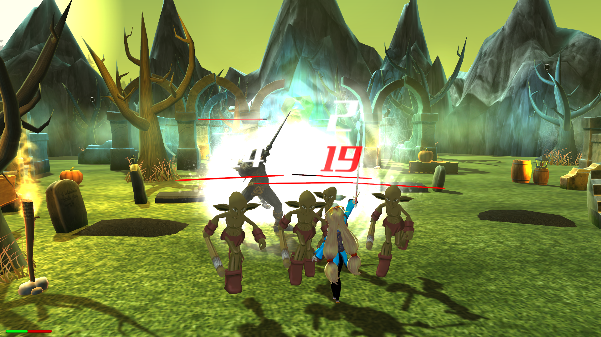

#NOT GENSHIN IMPACT!!! 

*A simple game, was a project at the university and was made with soul (and tears). The game is pretty easy to play.

*The first location is the world in which the main character lives. The essence of this location is to find 6 stars to activate the portal (borrowed the portal from VALVE from the Dota 2 project X)

* The second tocation represents the dark world of trolls where the sister of the main character was kidnapped. In order to free her, it is necessary to defeat all the trolls and the goblin.
To fight, the player has 4 magic skills and 4 ordinary ones. The "Q", "E", "U" and "O" buttons are responsible for magic abilities and the buttons "I", "J", "K" and "L" for normal abilities.
